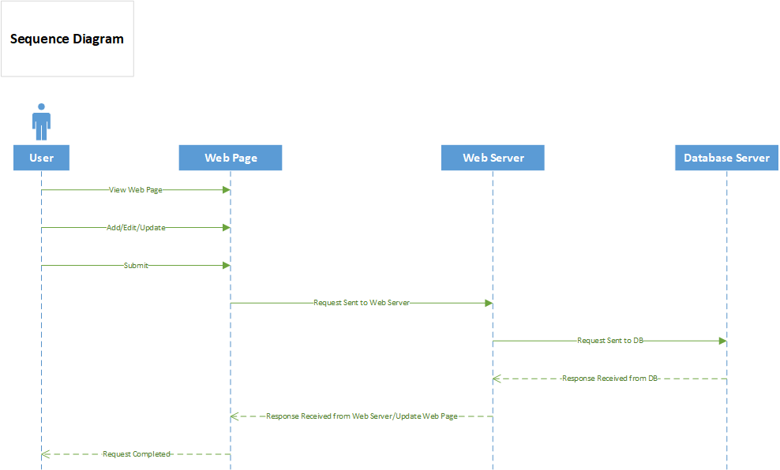

# TodoList Web Application

This is a simple php project that can be utilized to manage a todo list. It allows the user to keep track of tasks that they need to do. Each task has a status (I.E. Pending, Started, Completed, Late). Initially, it shows the user the count tasks per each status. Then, the user can click on any grouped set of tasks to show the each individual task under that specific task status. The application also allows the user to Add, Edit (onlty Task Status), and Delete a task.
  
A screen cast is included with the project (./BriefPresentation/ToDoPresentation.mp4) file which goes over the basic functionality and usage of this application.

## Dependencies

1. Apache Server
2. MySQL

## Deployment
You need to install Apache Server and MySQL on the target machine. The Apache server must be configured on port 80 and the MySQL port 3306. You can use (https://bitnami.com/stacks) to download WAMP Stack that will include Apache server and MySql, or you can download them separately.

## Work Breakdown

**1. Install WAMP Stack**
Estimated Time: 30 minutes  
Actual Time: 45 minutes  
Notes: I had to watch some videos on YouTube to make sure I install it properly.  
Issues: None  

**2. Get used to the phpMyAdmin environment"**
Estimated Time: 2 hour  
Actual Time: 2 hour  
Notes: I was just browsing to see the different functionalities and features of this tool.
Issues: None

**3. Get used to MySQL and Create MyFisrt Table"**
Estimated Time: 2 hour  
Actual Time: 3 hour  
Notes: I expected that since I am good with MS SQL server that MySQL would not take me longer than 2 hours. Unfortunately, it did as working on php GUI is far more unclear than working on MS SQL Management Studio.
Issues: just some getting used to things, I.E.: some syntax is different and the phpMyAdmin UI is kind of crowded.

**4. Create a basic php web page**
Estimated Time: 2 hour  
Actual Time: 5 hour  
Notes: I have no previous knowledge about web-development (besides basic HTML,CSS, and JavaScript). It took me some time to understand some concepts in Php (Syntax, Creating Variables, Loops, Arrays, etc...). I had to to watch some tutorials to know more.
Issues: Technically none, but it took me some time to understand some concepts in php being a server-side scripting language.  

**5. Plug in php code with HTML to provide a basic functional web-page**
Estimated Time: 2 hours  
Actual Time: 1 hour  
Notes: It was fairly easy to work with a basic HTML/PHP file.
Issues: None  

**6. Establish database connection from php to MySQL**
Estimated Time: 2 hours  
Actual Time: 6 hours  
Notes: I had to spend some time researching to find out how to connect from php to MySQL.  
Issues: I had some issues especially when I wanted to find a method to create the ToDo database (if it does not exit) and then create ToDoList table (if it does not exist).

**7. Building the "Add Task" functionality.**
Estimated Time: 2 hours   
Actual Time: 5 hour  
Notes: None
Issues: I had to dig deep and some research about integrating MySQL strings into php scripts.  

**8. Building the "Delete Task" functionality.**
Estimated Time: 1 hour 
Actual Time: 2 hours 
Notes: None. 
Issues: Had issues with single vs double quotes when using echo.

**9. Building the "Update Task" functionality.**
Estimated Time: 1 hour  
Actual Time: 4 hour  
Notes: None
Issues: I had a major issue of getting a radio button that was check for the task status (-Started  -Completed) and I had to do more research until I found the solution.

## Functional Requirements

1.	Add new tasks.
2.	View tasks. 
3.	Update the Status of a task that is Pending/Late to Started/Completed.
4.	Delete tasks. 
5.	Each task has a status (i.e. Pending, Started, Completed, Late). 
6.	Each task must have a due date.
7.	The main page must show how many total tasks are in the system and the count for each status type (i.e. 3 pending tasks).
8.	Clicking on the status count filters the list (or takes you to the new page) with these tasks.

## Non-Functional Requirements

1. The user interface (UI) for the todo application will be easy to use and understandable with no prior exposure.
2. Usability across multiple platforms is important and this application should work on different operating systems as it is a web-application. However, it might not display properly on mobile phones/tablets.
3. The web page should perform smoothly and fast when the user is interacting with the different components.
4. Removed todo entries will be completely deleted in the MySQL database so lower storage as possible, especially that this is not a mission-critical application.
5. Availability depends greatly on the host machine.
6. The application's code is easy to manage as it's located in one PHP file and another CSS file.

## Test Cases

**Database Creation if it does not exist**
Steps: 
1. Delete the database "todo_db"
2. Start the web-page.
3. The database "todo_db" should be created.
 
 **Database Creation if it does not exist**
Steps: 
1. Delete the database table "todolist"
2. Start the web-page.
3. The database table "todolist" should be created with the proper fields.

**Add Task**
Steps: 
1. Start the web-page 
2. Enter some value in the Task field.
3. Click "Add Task" button.
4. The task will be added as a "Pending" task. Click on the Pending button and you should see the task there.
 
**Delete Task**
Steps: 
1. Start the web-page 
2. Click on any grouped tasks (I.E: Pending, Started, Completed, Late).
3. Check the check-boxes right before the task(s) that you would like to delete.
4. Click "Delete Task(s)" button.
5. The task(s) will be removed from the database. Click on the same status-grouping button and you should see the task(s) is no longer there.

**Update Task Status**
Steps: 
1. Start the web-page 
2. Click on any grouped tasks (I.E: Pending, Started, Completed, Late).
3. Change the Status of the task.
4. Check the check-boxes right before the task(s) that you would like to update the status for.
5. The task status will be updated on the database. Click on the same status-grouping that you have update the task to, and you should see it there. 

**Seeing individual Tasks under a certain status**
Steps: 
1. Start the web-page 
2. If you don't have any tasks added yet, then add a task as shown previously in the "**Add Task**" test case.
3. Click on any grouped tasks (I.E: Pending, Started, Completed, Late).
4. You should see all the individual tasks under that status.

## System Architecture Diagram

## Data Flow Diagram

## Use Case

## Sequence Diagram

## Database Design
